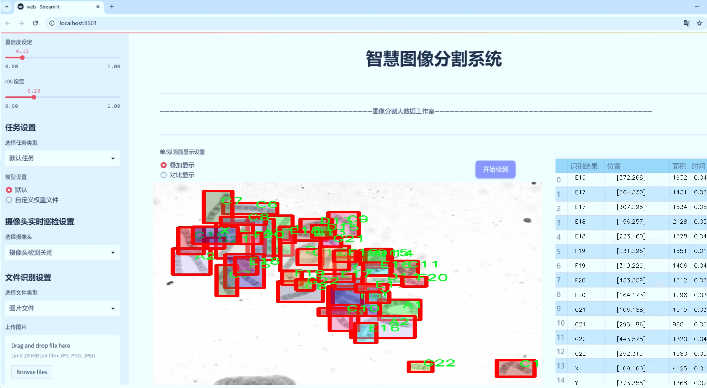
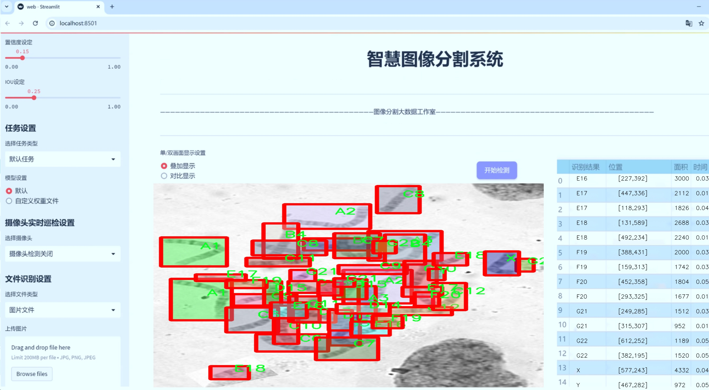
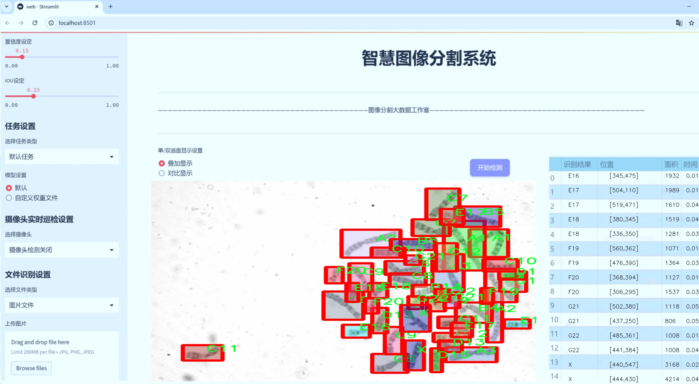
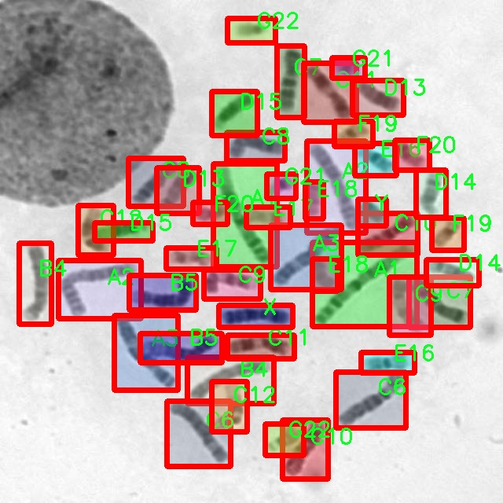
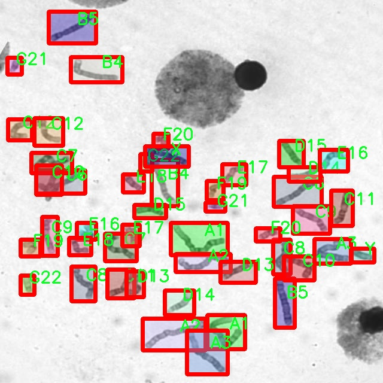
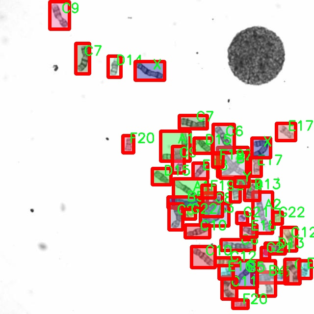
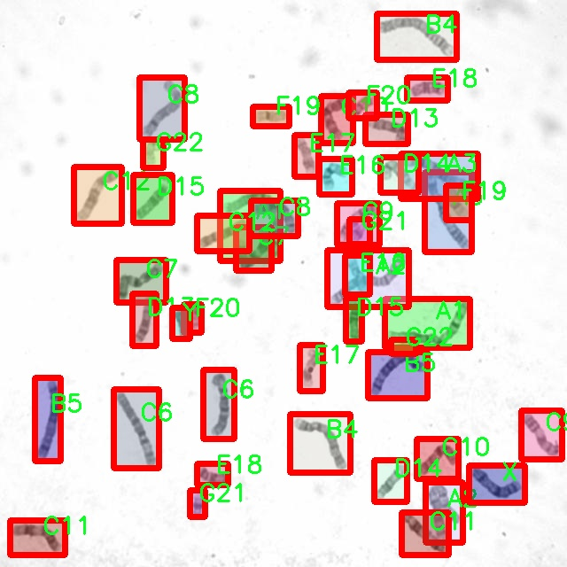
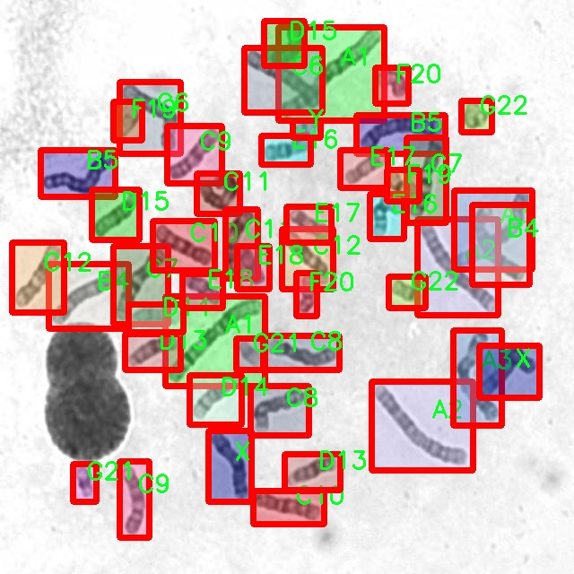

# 显微镜下染色体图像分割系统源码＆数据集分享
 [yolov8-seg-dyhead-DCNV3＆yolov8-seg-C2f-DCNV2-Dynamic等50+全套改进创新点发刊_一键训练教程_Web前端展示]

### 1.研究背景与意义

项目参考[ILSVRC ImageNet Large Scale Visual Recognition Challenge](https://gitee.com/YOLOv8_YOLOv11_Segmentation_Studio/projects)

项目来源[AAAI Global Al lnnovation Contest](https://kdocs.cn/l/cszuIiCKVNis)

研究背景与意义

在现代生物医学研究中，染色体的形态和结构分析对于理解遗传学、细胞生物学以及疾病机制具有重要意义。染色体异常与多种遗传性疾病、癌症及其他健康问题密切相关，因此，准确、高效地对染色体进行分割和识别成为了生物医学图像分析领域的重要任务。随着显微镜技术的进步，获取高分辨率的染色体图像变得更加容易，但随之而来的数据处理和分析的复杂性也显著增加。传统的图像处理方法在处理复杂的染色体图像时，往往面临着精度不足和效率低下的问题，这促使研究者们寻求更为先进的计算机视觉技术来提升图像分割的性能。

近年来，深度学习特别是卷积神经网络（CNN）的发展为图像分割任务带来了革命性的进展。其中，YOLO（You Only Look Once）系列模型因其实时性和高效性在目标检测和分割领域得到了广泛应用。YOLOv8作为该系列的最新版本，凭借其优越的性能和灵活的架构，展现出了在复杂场景下进行实例分割的巨大潜力。然而，针对显微镜下染色体图像的特定需求，YOLOv8仍存在一些局限性，如对小目标的分割能力不足、背景噪声干扰等。因此，基于YOLOv8的改进研究显得尤为重要。

本研究旨在构建一个基于改进YOLOv8的显微镜下染色体图像分割系统，利用9600幅图像和24个类别的丰富数据集，针对不同类型的染色体进行精确分割。该数据集涵盖了多种染色体类型，包括A类、B类、C类、D类、E类、F类、G类以及性染色体X和Y，能够为模型的训练和验证提供充分的样本支持。通过对YOLOv8模型的改进，我们将引入多尺度特征融合、注意力机制以及数据增强等技术，以提高模型在复杂背景下的鲁棒性和分割精度。

研究的意义不仅在于推动染色体图像分析技术的发展，更在于为临床遗传学、肿瘤学等领域提供强有力的工具支持。通过实现高效的染色体图像分割，研究人员和临床医生能够更快速、准确地识别染色体异常，从而为疾病的早期诊断和个性化治疗提供依据。此外，该系统的成功构建也将为其他生物医学图像分析任务提供借鉴，推动计算机视觉技术在生物医学领域的广泛应用。

综上所述，基于改进YOLOv8的显微镜下染色体图像分割系统的研究不仅具有重要的学术价值，也具备显著的实际应用前景，期待能够为未来的生物医学研究和临床实践带来积极的影响。

### 2.图片演示







##### 注意：由于此博客编辑较早，上面“2.图片演示”和“3.视频演示”展示的系统图片或者视频可能为老版本，新版本在老版本的基础上升级如下：（实际效果以升级的新版本为准）

  （1）适配了YOLOV8的“目标检测”模型和“实例分割”模型，通过加载相应的权重（.pt）文件即可自适应加载模型。

  （2）支持“图片识别”、“视频识别”、“摄像头实时识别”三种识别模式。

  （3）支持“图片识别”、“视频识别”、“摄像头实时识别”三种识别结果保存导出，解决手动导出（容易卡顿出现爆内存）存在的问题，识别完自动保存结果并导出到tempDir中。

  （4）支持Web前端系统中的标题、背景图等自定义修改，后面提供修改教程。

  另外本项目提供训练的数据集和训练教程,暂不提供权重文件（best.pt）,需要您按照教程进行训练后实现图片演示和Web前端界面演示的效果。

### 3.视频演示

[3.1 视频演示](https://www.bilibili.com/video/BV1Xp2zYWEfG/)

### 4.数据集信息展示

##### 4.1 本项目数据集详细数据（类别数＆类别名）

nc: 24
names: ['A1', 'A2', 'A3', 'B4', 'B5', 'C10', 'C11', 'C12', 'C6', 'C7', 'C8', 'C9', 'D13', 'D14', 'D15', 'E16', 'E17', 'E18', 'F19', 'F20', 'G21', 'G22', 'X', 'Y']


##### 4.2 本项目数据集信息介绍

数据集信息展示

在生物医学领域，显微镜下的染色体图像分析是遗传学研究和临床诊断中的重要环节。为了提高染色体图像分割的精度和效率，我们构建了一个名为“kromozom”的数据集，专门用于训练改进版的YOLOv8-seg模型。该数据集包含24个不同类别的染色体，旨在为研究人员和临床医生提供一个高质量的图像分割工具，以便更好地理解和分析染色体的结构与功能。

“kromozom”数据集的类别数量为24，涵盖了多种类型的染色体，具体类别包括：A1、A2、A3、B4、B5、C10、C11、C12、C6、C7、C8、C9、D13、D14、D15、E16、E17、E18、F19、F20、G21、G22、X和Y。这些类别代表了不同的染色体类型，每一种染色体在形态、大小和染色特征上都有其独特之处，反映了遗传信息的多样性。

在数据集的构建过程中，我们采用了高分辨率的显微镜图像，以确保每个染色体的细节都能被清晰捕捉。图像的采集涉及多个样本和不同的染色体准备技术，确保了数据集的多样性和代表性。通过对这些图像进行标注，我们为每个染色体类别提供了精确的分割边界，使得模型在训练过程中能够学习到不同染色体的特征和形态。

为了提升YOLOv8-seg模型在染色体图像分割任务中的表现，我们在数据集的预处理阶段进行了多种图像增强技术的应用。这些技术包括旋转、缩放、翻转和颜色调整等，旨在增加数据集的多样性，从而提高模型的泛化能力。此外，我们还进行了数据集的划分，确保训练集、验证集和测试集的合理比例，以便在模型训练和评估过程中能够获得可靠的结果。

“kromozom”数据集不仅为染色体图像分割提供了丰富的样本，还为后续的研究和应用奠定了基础。通过使用该数据集，研究人员可以深入探讨染色体的结构与功能，进而推动遗传学、细胞生物学等领域的研究进展。同时，该数据集的应用也有助于提高临床诊断的准确性，为患者提供更为精准的医疗服务。

总之，“kromozom”数据集是一个经过精心设计和构建的高质量数据集，旨在为显微镜下染色体图像分割提供强有力的支持。通过结合先进的深度学习技术，我们期待该数据集能够在染色体分析和相关研究中发挥重要作用，推动科学研究的不断进步。











### 5.全套项目环境部署视频教程（零基础手把手教学）

[5.1 环境部署教程链接（零基础手把手教学）](https://www.bilibili.com/video/BV1jG4Ve4E9t/?vd_source=bc9aec86d164b67a7004b996143742dc)


[5.2 安装Python虚拟环境创建和依赖库安装视频教程链接（零基础手把手教学）](https://www.bilibili.com/video/BV1nA4VeYEze/?vd_source=bc9aec86d164b67a7004b996143742dc)

### 6.手把手YOLOV8-seg训练视频教程（零基础小白有手就能学会）

[6.1 手把手YOLOV8-seg训练视频教程（零基础小白有手就能学会）](https://www.bilibili.com/video/BV1cA4VeYETe/?vd_source=bc9aec86d164b67a7004b996143742dc)


按照上面的训练视频教程链接加载项目提供的数据集，运行train.py即可开始训练



     Epoch   gpu_mem       box       obj       cls    labels  img_size
     1/200     0G   0.01576   0.01955  0.007536        22      1280: 100%|██████████| 849/849 [14:42<00:00,  1.04s/it]
               Class     Images     Labels          P          R     mAP@.5 mAP@.5:.95: 100%|██████████| 213/213 [01:14<00:00,  2.87it/s]
                 all       3395      17314      0.994      0.957      0.0957      0.0843

     Epoch   gpu_mem       box       obj       cls    labels  img_size
     2/200     0G   0.01578   0.01923  0.007006        22      1280: 100%|██████████| 849/849 [14:44<00:00,  1.04s/it]
               Class     Images     Labels          P          R     mAP@.5 mAP@.5:.95: 100%|██████████| 213/213 [01:12<00:00,  2.95it/s]
                 all       3395      17314      0.996      0.956      0.0957      0.0845

     Epoch   gpu_mem       box       obj       cls    labels  img_size
     3/200     0G   0.01561    0.0191  0.006895        27      1280: 100%|██████████| 849/849 [10:56<00:00,  1.29it/s]
               Class     Images     Labels          P          R     mAP@.5 mAP@.5:.95: 100%|███████   | 187/213 [00:52<00:00,  4.04it/s]
                 all       3395      17314      0.996      0.957      0.0957      0.0845


### 7.50+种全套YOLOV8-seg创新点代码加载调参视频教程（一键加载写好的改进模型的配置文件）

[7.1 50+种全套YOLOV8-seg创新点代码加载调参视频教程（一键加载写好的改进模型的配置文件）](https://www.bilibili.com/video/BV1Hw4VePEXv/?vd_source=bc9aec86d164b67a7004b996143742dc)

### 8.YOLOV8-seg图像分割算法原理

原始YOLOv8-seg算法原理

YOLOv8-seg算法是YOLO系列中最新的目标检测与分割算法，它在YOLOv5和YOLOv7的基础上进行了多项创新和改进，旨在提升目标检测的精度和速度。该算法的核心架构依然由输入层、主干网络、特征融合层和解耦头构成，然而在每个模块中都融入了新的设计理念和技术，以应对更复杂的目标检测任务。

首先，YOLOv8的主干网络采用了CSPDarknet的设计理念，并在此基础上对C3模块进行了替换，采用了C2f模块。这一改进不仅实现了模型的轻量化，还保持了检测精度的稳定性。C2f模块的设计灵感来源于YOLOv7的ELAN结构，通过引入更多的分支和跨层连接，增强了梯度流的丰富性，使得网络能够更有效地学习到目标的特征。此外，YOLOv8还引入了SPPF（Spatial Pyramid Pooling Fusion）模块，进一步提升了特征提取的能力，使得网络在处理不同尺度的目标时表现得更加出色。

在特征融合层，YOLOv8采用了PAN-FPN（Path Aggregation Network with Feature Pyramid Network）结构，这一结构能够有效地将不同层次的特征进行深度融合。与YOLOv5相比，YOLOv8在上采样阶段的设计上进行了优化，去除了1x1卷积，直接将高层特征与中层特征进行连接，从而实现了更高效的特征融合。这种设计使得YOLOv8能够更好地捕捉到目标的细节信息与语义信息，提升了目标检测的准确性。

YOLOv8的一个显著特点是其采用了Anchor-Free的思想，抛弃了传统的Anchor-Base方法。这一转变使得模型在目标检测时不再依赖于预定义的锚框，从而减少了锚框预测的数量，加速了非最大抑制（NMS）过程，进一步提升了检测速度和效率。此外，YOLOv8引入了Task-Aligned的样本匹配策略，使得正负样本的分配更加灵活和高效，这对于提高模型的学习效果至关重要。

在损失函数的设计上，YOLOv8采用了VFLLoss作为分类损失，并结合DFLLoss和CIoULoss作为回归损失。这种多重损失函数的设计使得模型在训练过程中能够更好地平衡分类与回归的任务，提高了目标检测的精度和鲁棒性。特别是在处理小目标和样本不平衡的问题时，Focal Loss的引入有效地增强了模型对困难样本的关注，提升了整体的检测性能。

YOLOv8的头部网络结构也进行了显著的改进，采用了解耦头的设计，将分类和回归任务分开处理。这一设计不仅提高了模型的灵活性，还使得损失计算过程更加清晰。YOLOv8的头部网络输出三个不同尺度的特征图，分别为80x80、40x40和20x20，能够针对不同大小的目标进行有效的检测和分类。通过使用Softmax和卷积操作，YOLOv8能够将预测结果转换为真实的边界框格式，从而实现高效的目标定位。

在数据预处理方面，YOLOv8延续了YOLOv5的策略，采用了多种数据增强手段，如马赛克增强、混合增强、空间扰动和颜色扰动等。这些增强手段的引入，不仅丰富了训练数据的多样性，还有效提高了模型的泛化能力，使得YOLOv8在实际应用中能够更好地适应不同场景和条件下的目标检测任务。

总的来说，YOLOv8-seg算法通过在主干网络、特征融合、损失函数和头部网络等多个方面的创新，极大地提升了目标检测的精度和速度。其Anchor-Free的设计理念和解耦头的结构，使得YOLOv8在处理复杂场景时表现得更加灵活和高效。随着YOLOv8的推出，目标检测领域迎来了新的技术突破，为各类应用场景提供了更为强大的支持。无论是在自动驾驶、安防监控，还是在工业检测等领域，YOLOv8都展现出了其卓越的性能和广泛的应用潜力。


### 9.系统功能展示（检测对象为举例，实际内容以本项目数据集为准）

图9.1.系统支持检测结果表格显示

  图9.2.系统支持置信度和IOU阈值手动调节

  图9.3.系统支持自定义加载权重文件best.pt(需要你通过步骤5中训练获得)

  图9.4.系统支持摄像头实时识别

  图9.5.系统支持图片识别

  图9.6.系统支持视频识别

  图9.7.系统支持识别结果文件自动保存

  图9.8.系统支持Excel导出检测结果数据


### 10.50+种全套YOLOV8-seg创新点原理讲解（非科班也可以轻松写刊发刊，V11版本正在科研待更新）

#### 10.1 由于篇幅限制，每个创新点的具体原理讲解就不一一展开，具体见下列网址中的创新点对应子项目的技术原理博客网址【Blog】：


[10.1 50+种全套YOLOV8-seg创新点原理讲解链接](https://gitee.com/qunmasj/good)

#### 10.2 部分改进模块原理讲解(完整的改进原理见上图和技术博客链接)【如果此小节的图加载失败可以通过CSDN或者Github搜索该博客的标题访问原始博客，原始博客图片显示正常】
### YOLOv8简介

YOLOv8是一种最新的SOTA算法，提供了N/S/M/L/X尺度的不同大小模型，以满足不同场景的需求。本章对算法网络的新特性进行简要介绍。


1）骨干网络和Neck
开发者设计了C2f模块对CSPDarkNet 53和PAFPN进行改造。相比C3模块，C2f模块拥有更多的分支跨层链接，使模型的梯度流更加丰富，显著增强了模型的特征提取能力。
2)Head部分
Head部分采用无锚框设计，将分类任务和回归任务进行了解耦，独立的分支将更加专注于其所负责的特征信息。
3）损失计算
模型使用CIOU Loss作为误差损失函数，并通过最小化DFL进一步提升边界框的回归精度。同时模型采用了TaskAlignedAssigner样本分配策略，以分类得分和IOU的高阶组合作为指标指导正负样本选择，实现了高分类得分和高IOU的对齐，有效地提升了模型的检测精度。


### D-LKA Attention简介
自2010年代中期以来，卷积神经网络（CNNs）已成为许多计算机视觉应用的首选技术。它们能够从原始数据中自动提取复杂的特征表示，无需手动进行特征工程，这引起了医学图像分析社区的极大兴趣。许多成功的CNN架构，如U-Net、全卷积网络、DeepLab或SegCaps（分割胶囊），已经被开发出来。这些架构在语义分割任务中取得了巨大成功，先前的最新方法已经被超越。

在计算机视觉研究中，不同尺度下的目标识别是一个关键问题。在CNN中，可检测目标的大小与相应网络层的感受野尺寸密切相关。如果一个目标扩展到超出这个感受野的边界，这可能会导致欠分割结果。相反，与目标实际大小相比使用过大的感受野可能会限制识别，因为背景信息可能会对预测产生不必要的影响。

解决这个问题的一个有希望的方法涉及在并行使用具有不同尺寸的多个Kernel，类似于Inception块的机制。然而，由于参数和计算要求的指数增长，将Kernel大小增加以容纳更大的目标在实践中受到限制。因此，出现了各种策略，包括金字塔池化技术和不同尺度的扩张卷积，以捕获多尺度的上下文信息。

另一个直观的概念涉及将多尺度图像金字塔或它们的相关特征表示直接纳入网络架构。然而，这种方法存在挑战，特别是在管理训练和推理时间方面的可行性方面存在挑战。在这个背景下，使用编码器-解码器网络，如U-Net，已被证明是有利的。这样的网络在较浅的层中编码外观和位置，而在更深的层中，通过神经元的更广泛的感受野捕获更高的语义信息和上下文信息。

一些方法将来自不同层的特征组合在一起，或者预测来自不同尺寸的层的特征以使用多尺度的信息。此外，出现了从不同尺度的层中预测特征的方法，有效地实现了跨多个尺度的见解整合。然而，大多数编码器-解码器结构面临一个挑战：它们经常无法在不同尺度之间保持一致的特征，并主要使用最后一个解码器层生成分割结果。

语义分割是一项任务，涉及根据预定义的标签集为图像中的每个像素预测语义类别。这项任务要求提取高级特征同时保留初始的空间分辨率。CNNs非常适合捕获局部细节和低级信息，尽管以忽略全局上下文为代价。视觉Transformer（ViT）架构已经成为解决处理全局信息的视觉任务的关键，包括语义分割，取得了显著的成功。

ViT的基础是注意力机制，它有助于在整个输入序列上聚合信息。这种能力使网络能够合并远程的上下文提示，超越了CNN的有限感受野尺寸。然而，这种策略通常会限制ViT有效建模局部信息的能力。这种局限可能会妨碍它们检测局部纹理的能力，这对于各种诊断和预测任务至关重要。这种缺乏局部表示可以归因于ViT模型处理图像的特定方式。

ViT模型将图像分成一系列Patch，并使用自注意力机制来模拟它们之间的依赖关系。这种方法可能不如CNN模型中的卷积操作对感受野内提取局部特征有效。ViT和CNN模型之间的这种图像处理方法的差异可能解释了CNN模型在局部特征提取方面表现出色的原因。

近年来，已经开发出创新性方法来解决Transformer模型内部局部纹理不足的问题。其中一种方法是通过互补方法将CNN和ViT特征结合起来，以结合它们的优势并减轻局部表示的不足。TransUNet是这种方法的早期示例，它在CNN的瓶颈中集成了Transformer层，以模拟局部和全局依赖关系。HiFormer提出了一种解决方案，将Swin Transformer模块和基于CNN的编码器结合起来，生成两个多尺度特征表示，通过Double-Level Fusion模块集成。UNETR使用基于Transformer的编码器和CNN解码器进行3D医学图像分割。CoTr和TransBTS通过Transformer在低分辨率阶段增强分割性能，将CNN编码器和解码器连接在一起。

增强局部特征表示的另一种策略是重新设计纯Transformer模型内部的自注意力机制。在这方面，Swin-Unet在U形结构中集成了一个具有线性计算复杂性的Swin Transformer块作为多尺度 Backbone 。MISSFormer采用高效Transformer来解决视觉Transformer中的参数问题，通过在输入块上进行不可逆的降采样操作。D-Former引入了一个纯Transformer的管道，具有双重注意模块，以分段的方式捕获细粒度的局部注意和与多元单元的交互。然而，仍然存在一些特定的限制，包括计算效率低下，如TransUNet模型所示，对CNN Backbone 的严重依赖，如HiFormer所观察到的，以及对多尺度信息的忽略。

此外，目前的分割架构通常采用逐层处理3D输入 volumetric 的方法，无意中忽视了相邻切片之间的潜在相关性。这一疏忽限制了对 volumetric 信息的全面利用，因此损害了定位精度和上下文集成。此外，必须认识到，医学领域的病变通常在形状上发生变形。因此，用于医学图像分析的任何学习算法都必须具备捕捉和理解这些变形的能力。与此同时，该算法应保持计算效率，以便处理3D volumetric数据。

为了解决上述提到的挑战，作者提出了一个解决方案，即可变形大卷积核注意力模块（Deformable LKA module），它是作者网络设计的基本构建模块。这个模块明确设计成在有效处理上下文信息的同时保留局部描述符。作者的架构在这两个方面的平衡增强了实现精确语义分割的能力。

值得注意的是，参考该博客引入了一种基于数据的感受野的动态适应，不同于传统卷积操作中的固定滤波器Mask。这种自适应方法使作者能够克服与静态方法相关的固有限制。这种创新方法还扩展到了D-LKA Net架构的2D和3D版本的开发。

在3D模型的情况下，D-LKA机制被量身定制以适应3D环境，从而实现在不同 volumetric 切片之间无缝信息交互。最后，作者的贡献通过其计算效率得到进一步强调。作者通过仅依靠D-LKA概念的设计来实现这一点，在各种分割基准上取得了显著的性能，确立了作者的方法作为一种新的SOTA方法。

在本节中，作者首先概述方法论。首先，作者回顾了由Guo等人引入的大卷积核注意力（Large Kernel Attention，LKA）的概念。然后，作者介绍了作者对可变形LKA模块的创新探索。在此基础上，作者介绍了用于分割任务的2D和3D网络架构。

大卷积核提供了与自注意力机制类似的感受野。可以通过使用深度卷积、深度可扩展卷积和卷积来构建大卷积核，从而减少了参数和计算量。构建输入维度为和通道数的卷积核的深度卷积和深度可扩展卷积的卷积核大小的方程如下：


具有卷积核大小和膨胀率。参数数量和浮点运算（FLOPs）的计算如下：


FLOPs的数量与输入图像的大小成线性增长。参数的数量随通道数和卷积核大小的增加而呈二次增长。然而，由于它们通常都很小，因此它们不是限制因素。

为了最小化对于固定卷积核大小K的参数数量，可以将方程3对于膨胀率的导数设定为零：


例如，当卷积核大小为时，结果是。将这些公式扩展到3D情况是直接的。对于大小为和通道数C的输入，3D情况下参数数量和FLOPs 的方程如下：


具有卷积核大小和膨胀。


利用大卷积核进行医学图像分割的概念通过引入可变形卷积得以扩展。可变形卷积可以通过整数偏移自由调整采样网格以进行自由变形。额外的卷积层从特征图中学习出变形，从而创建一个偏移场。基于特征本身学习变形会导致自适应卷积核。这种灵活的卷积核形状可以提高病变或器官变形的表示，从而增强了目标边界的定义。

负责计算偏移的卷积层遵循其相应卷积层的卷积核大小和膨胀。双线性插值用于计算不在图像网格上的偏移的像素值。如图2所示，D-LKA模块可以表示为：


其中输入特征由表示，。表示为注意力图，其中每个值表示相应特征的相对重要性。运算符  表示逐元素乘法运算。值得注意的是，LKA不同于传统的注意力方法，它不需要额外的规范化函数，如或。这些规范化函数往往忽视高频信息，从而降低了基于自注意力的方法的性能。

在该方法的2D版本中，卷积层被可变形卷积所替代，因为可变形卷积能够改善对具有不规则形状和大小的目标的捕捉能力。这些目标在医学图像数据中常常出现，因此这种增强尤为重要。

然而，将可变形LKA的概念扩展到3D领域会带来一定的挑战。主要的约束来自于需要用于生成偏移的额外卷积层。与2D情况不同，由于输入和输出通道的性质，这一层无法以深度可分的方式执行。在3D环境中，输入通道对应于特征，而输出通道扩展到，其中是卷积核的大小。大卷积核的复杂性导致沿第3D的通道数扩展，导致参数和FLOPs大幅增加。因此，针对3D情况采用了另一种替代方法。在现有的LKA框架中，深度卷积之后引入了一个单独的可变形卷积层。这种战略性的设计调整旨在减轻扩展到3D领域所带来的挑战。


2D网络的架构如图1所示。第一变种使用MaxViT作为编码器组件，用于高效特征提取，而第二变种则结合可变形LKA层进行更精细、卓越的分割。

在更正式的描述中，编码器生成4个分层输出表示。首先，卷积干扰将输入图像的维度减小到。随后，通过4个MaxViT块的4个阶段进行特征提取，每个阶段后跟随降采样层。随着过程进展到解码器，实施了4个阶段的D-LKA层，每个阶段包含2个D-LKA块。然后，应用Patch扩展层以实现分辨率上采样，同时减小通道维度。最后，线性层负责生成最终的输出。

2D D-LKA块的结构包括LayerNorm、可变形LKA和多层感知器（MLP）。积分残差连接确保了有效的特征传播，即使在更深层也是如此。这个安排可以用数学方式表示为：


其中输入特征，层归一化LN，可变形LKA注意力，深度卷积，线性层和GeLU激活函数。

3D网络架构如图1所示，采用编码器-解码器设计进行分层结构化。首先，一个Patch嵌入层将输入图像的维度从（）减小到（）。在编码器中，采用了3个D-LKA阶段的序列，每个阶段包含3个D-LKA块。在每个阶段之后，通过降采样步骤将空间分辨率减半，同时将通道维度加倍。中央瓶颈包括另一组2个D-LKA块。解码器结构与编码器相对称。

为了将特征分辨率加倍，同时减少通道数，使用转置卷积。每个解码器阶段都使用3个D-LKA块来促进远距离特征依赖性。最终的分割输出由一个卷积层产生，后面跟随一个卷积层以匹配特定类别的通道要求。

为了建立输入图像和分割输出之间的直接连接，使用卷积形成了一个跳跃连接。额外的跳跃连接根据简单的加法对来自其他阶段的特征进行融合。最终的分割图是通过和卷积层的组合产生的。

3D D-LKA块包括层归一化，后跟D-LKA注意力，应用了残差连接的部分。随后的部分采用了一个卷积层，后面跟随一个卷积层，两者都伴随着残差连接。这个整个过程可以总结如下：


带有输入特征 、层归一化 、可变形 LKA 、卷积层 和输出特征 的公式。是指一个前馈网络，包括2个卷积层和激活函数。

表7显示了普通卷积和构建卷积的参数数量比较。尽管标准卷积的参数数量在通道数较多时急剧增加，但分解卷积的参数总体较低，并且增长速度不那么快。

与分解卷积相比，可变形分解卷积增加了大量参数，但仍然明显小于标准卷积。可变形卷积的主要参数是由偏移网络创建的。在这里，作者假设可变形深度卷积的Kernel大小为（5,5），可变形深度空洞卷积的Kernel大小为（7,7）。这导致了21×21大小的大Kernel的最佳参数数量。更高效地生成偏移量的方法将大大减少参数数量。


值得注意的是，引入可变形LKA确实会增加模型的参数数量和每秒的浮点运算次数（FLOPS）。然而，重要的是强调，这增加的计算负载不会影响作者模型的整体推理速度。

相反，对于Batch-size > 1，作者甚至观察到推理时间的减少，如图7所示。例如，基于作者的广泛实验，作者观察到对于Batch-size为16，具有可变形卷积和没有可变形卷积的推理时间分别为8.01毫秒和17.38毫秒。作者认为这是由于在2D中对可变形卷积的高效实现所致。为了测量时间，使用了大小为（）的随机输入。在GPU热身周期50次迭代之后，网络被推断了1000次。测量是在NVIDIA RTX 3090 GPU上进行的。


为了充分利用性能与参数之间的权衡关系，作者在图8中可视化了在Synapse 2D数据集上报告的DSC和HD性能以及基于参数数量的内存消耗。D-LKA Net引入了相当多的参数，约为101M。这比性能第二好的方法ScaleFormer使用的111.6M参数要少。

与更轻量级的DAEFormer模型相比，作者实现了更好的性能，这证明了参数增加的合理性。大多数参数来自于MaxViT编码器；因此，将编码器替换为更高效的编码器可以减少模型参数。值得注意的是，在此可视化中，作者最初将HD和内存值都归一化到[0, 100]范围内。随后，作者将它们从100缩小，以增强更高值的表示。


### 11.项目核心源码讲解（再也不用担心看不懂代码逻辑）

#### 11.1 ultralytics\engine\__init__.py

当然可以！不过您提供的代码片段仅包含了一行注释，缺少具体的代码内容。为了能够进行详细的分析和注释，您能否提供更多的代码内容？这样我才能帮助您提取核心部分并进行注释。谢谢！

这个文件是Ultralytics YOLO项目的一部分，文件名为`__init__.py`，它的主要作用是将该目录标识为一个Python包。文件中包含了一行注释，表明该项目是Ultralytics YOLO，并且使用AGPL-3.0许可证。

AGPL-3.0许可证是一种开源许可证，允许用户自由使用、修改和分发软件，但要求在分发修改后的版本时，必须提供源代码，并且如果通过网络提供软件服务，也必须提供源代码。这种许可证通常用于确保软件的自由使用和共享。

虽然这个文件的内容非常简单，只有一行注释，但它在Python包的结构中起着重要的作用。通过包含这个文件，Python解释器能够识别这个目录为一个包，从而允许其他模块导入这个包中的内容。

总的来说，`__init__.py`文件是Python包的一个标准组成部分，尽管在这个特定的文件中没有其他代码或功能实现，但它的存在对于包的组织和使用是必不可少的。

#### 11.2 ultralytics\models\yolo\pose\__init__.py

```python
# 导入必要的模块
# PosePredictor：用于姿态预测的类
# PoseTrainer：用于训练模型的类
# PoseValidator：用于验证模型性能的类
from .predict import PosePredictor
from .train import PoseTrainer
from .val import PoseValidator

# 定义模块的公开接口
# 通过 __all__ 变量指定可以被外部导入的类
__all__ = 'PoseTrainer', 'PoseValidator', 'PosePredictor'
```

### 代码核心部分及注释说明：

1. **导入模块**：
   - `from .predict import PosePredictor`：从当前包中导入姿态预测器类 `PosePredictor`，该类负责根据输入数据进行姿态估计。
   - `from .train import PoseTrainer`：从当前包中导入训练器类 `PoseTrainer`，该类用于训练姿态估计模型。
   - `from .val import PoseValidator`：从当前包中导入验证器类 `PoseValidator`，该类用于评估训练后的模型性能。

2. **定义公开接口**：
   - `__all__` 变量用于定义当使用 `from module import *` 语句时，哪些类或函数是可以被导入的。在这里，公开了 `PoseTrainer`、`PoseValidator` 和 `PosePredictor` 三个类，方便用户使用这些功能而不需要直接访问模块内部的实现细节。

这个程序文件是Ultralytics YOLO项目中的一个模块，主要用于姿态估计（Pose Estimation）。文件的开头包含了一条版权声明，表明该代码遵循AGPL-3.0许可证。

在文件中，首先通过相对导入的方式引入了三个类：`PosePredictor`、`PoseTrainer`和`PoseValidator`。这些类分别负责姿态估计的不同功能。`PosePredictor`用于进行姿态预测，`PoseTrainer`用于训练模型，而`PoseValidator`则用于验证模型的性能。

最后，`__all__`变量被定义为一个元组，包含了这三个类的名称。这意味着当使用`from ultralytics.models.yolo.pose import *`这种方式导入时，只会导入`PoseTrainer`、`PoseValidator`和`PosePredictor`这三个类。这种做法有助于控制模块的公共接口，确保只暴露必要的部分给外部使用者。

#### 11.3 ultralytics\utils\triton.py

以下是经过简化和注释的核心代码部分：

```python
# 导入必要的库
from typing import List
from urllib.parse import urlsplit
import numpy as np

class TritonRemoteModel:
    """
    与远程Triton推理服务器模型交互的客户端。

    属性:
        endpoint (str): Triton服务器上模型的名称。
        url (str): Triton服务器的URL。
        triton_client: Triton客户端（HTTP或gRPC）。
        InferInput: Triton客户端的输入类。
        InferRequestedOutput: Triton客户端的输出请求类。
        input_formats (List[str]): 模型输入的数据类型。
        np_input_formats (List[type]): 模型输入的numpy数据类型。
        input_names (List[str]): 模型输入的名称。
        output_names (List[str]): 模型输出的名称。
    """

    def __init__(self, url: str, endpoint: str = '', scheme: str = ''):
        """
        初始化TritonRemoteModel。

        参数可以单独提供或从一个统一的'url'参数解析，格式为
            <scheme>://<netloc>/<endpoint>/<task_name>

        参数:
            url (str): Triton服务器的URL。
            endpoint (str): Triton服务器上模型的名称。
            scheme (str): 通信方案（'http'或'gRPC'）。
        """
        # 如果没有提供endpoint和scheme，则从URL中解析
        if not endpoint and not scheme:
            splits = urlsplit(url)
            endpoint = splits.path.strip('/').split('/')[0]  # 获取模型名称
            scheme = splits.scheme  # 获取通信方案
            url = splits.netloc  # 获取网络地址

        self.endpoint = endpoint  # 设置模型名称
        self.url = url  # 设置服务器URL

        # 根据通信方案选择Triton客户端
        if scheme == 'http':
            import tritonclient.http as client  # 导入HTTP客户端
            self.triton_client = client.InferenceServerClient(url=self.url, verbose=False, ssl=False)
            config = self.triton_client.get_model_config(endpoint)  # 获取模型配置
        else:
            import tritonclient.grpc as client  # 导入gRPC客户端
            self.triton_client = client.InferenceServerClient(url=self.url, verbose=False, ssl=False)
            config = self.triton_client.get_model_config(endpoint, as_json=True)['config']  # 获取模型配置

        # 按字母顺序排序输出名称
        config['output'] = sorted(config['output'], key=lambda x: x.get('name'))

        # 定义模型属性
        type_map = {'TYPE_FP32': np.float32, 'TYPE_FP16': np.float16, 'TYPE_UINT8': np.uint8}
        self.InferRequestedOutput = client.InferRequestedOutput  # 设置输出请求类
        self.InferInput = client.InferInput  # 设置输入类
        self.input_formats = [x['data_type'] for x in config['input']]  # 获取输入数据类型
        self.np_input_formats = [type_map[x] for x in self.input_formats]  # 获取numpy数据类型
        self.input_names = [x['name'] for x in config['input']]  # 获取输入名称
        self.output_names = [x['name'] for x in config['output']]  # 获取输出名称

    def __call__(self, *inputs: np.ndarray) -> List[np.ndarray]:
        """
        使用给定的输入调用模型。

        参数:
            *inputs (List[np.ndarray]): 模型的输入数据。

        返回:
            List[np.ndarray]: 模型的输出。
        """
        infer_inputs = []  # 初始化输入列表
        input_format = inputs[0].dtype  # 获取输入数据类型
        for i, x in enumerate(inputs):
            # 如果输入数据类型与预期不符，则转换数据类型
            if x.dtype != self.np_input_formats[i]:
                x = x.astype(self.np_input_formats[i])
            # 创建InferInput对象并设置数据
            infer_input = self.InferInput(self.input_names[i], [*x.shape], self.input_formats[i].replace('TYPE_', ''))
            infer_input.set_data_from_numpy(x)  # 从numpy数组设置数据
            infer_inputs.append(infer_input)  # 添加到输入列表

        # 创建输出请求
        infer_outputs = [self.InferRequestedOutput(output_name) for output_name in self.output_names]
        # 调用Triton客户端进行推理
        outputs = self.triton_client.infer(model_name=self.endpoint, inputs=infer_inputs, outputs=infer_outputs)

        # 返回输出结果
        return [outputs.as_numpy(output_name).astype(input_format) for output_name in self.output_names]
```

### 代码说明：
1. **类定义**：`TritonRemoteModel`类用于与Triton推理服务器进行交互。
2. **初始化方法**：`__init__`方法解析URL并初始化Triton客户端，获取模型配置，设置输入输出的相关属性。
3. **调用方法**：`__call__`方法允许使用numpy数组作为输入，进行推理并返回输出结果。通过设置输入数据和请求输出，调用Triton客户端的推理功能。

这个程序文件定义了一个名为 `TritonRemoteModel` 的类，用于与远程的 Triton 推理服务器模型进行交互。Triton 是一个高性能的推理服务器，支持多种模型和推理框架。

在类的文档字符串中，列出了该类的主要属性，包括模型的名称、服务器的 URL、客户端类型、输入输出格式等。这些属性帮助用户了解如何与 Triton 服务器进行交互。

构造函数 `__init__` 用于初始化 `TritonRemoteModel` 实例。用户可以通过 URL 字符串或单独的参数来提供服务器的地址、模型名称和通信协议（HTTP 或 gRPC）。如果没有提供模型名称和协议，构造函数会从 URL 中解析这些信息。根据指定的协议，程序会导入相应的 Triton 客户端库，并创建一个 Triton 客户端实例。接着，它会获取模型的配置，并根据输出名称进行排序。模型的输入输出格式和名称也会被提取并存储，以便后续使用。

`__call__` 方法使得 `TritonRemoteModel` 实例可以像函数一样被调用。该方法接受一个或多个 NumPy 数组作为输入，并将其转换为 Triton 客户端所需的格式。首先，它会检查输入数据的类型是否与模型要求的类型一致，如果不一致，则进行类型转换。然后，构建输入数据对象，并将其添加到请求中。接下来，构建输出请求对象，并调用 Triton 客户端的推理方法。最后，返回模型的输出结果，输出结果会被转换回原始输入的数据类型。

总体而言，这个文件实现了与 Triton 推理服务器的基本交互功能，允许用户方便地进行模型推理。通过这个类，用户可以轻松地发送输入数据并获取模型的输出，适用于各种深度学习应用场景。

#### 11.4 ultralytics\nn\autobackend.py

以下是代码中最核心的部分，并附上详细的中文注释：

```python
class AutoBackend(nn.Module):
    """
    处理Ultralytics YOLO模型的动态后端选择，用于推理。
    """

    @torch.no_grad()
    def __init__(self,
                 weights='yolov8n.pt',
                 device=torch.device('cpu'),
                 dnn=False,
                 data=None,
                 fp16=False,
                 fuse=True,
                 verbose=True):
        """
        初始化AutoBackend以进行推理。

        参数:
            weights (str): 模型权重文件的路径，默认为'yolov8n.pt'。
            device (torch.device): 运行模型的设备，默认为CPU。
            dnn (bool): 是否使用OpenCV DNN模块进行ONNX推理，默认为False。
            data (str | Path | optional): 包含类名的额外data.yaml文件的路径，默认为None。
            fp16 (bool): 是否启用半精度推理，仅在特定后端支持，默认为False。
            fuse (bool): 是否融合Conv2D + BatchNorm层以优化，默认为True。
            verbose (bool): 是否启用详细日志，默认为True。
        """
        super().__init__()
        # 处理权重文件路径
        w = str(weights[0] if isinstance(weights, list) else weights)
        # 确定模型类型
        pt, jit, onnx, xml, engine, coreml, saved_model, pb, tflite, edgetpu, tfjs, paddle, ncnn, triton = \
            self._model_type(w)

        # 设置FP16支持
        fp16 &= pt or jit or onnx or xml or engine  # FP16
        nhwc = coreml or saved_model or pb or tflite or edgetpu  # BHWC格式
        stride = 32  # 默认步幅
        model, metadata = None, None

        # 设置设备
        cuda = torch.cuda.is_available() and device.type != 'cpu'  # 使用CUDA
        if cuda and not any([nn_module, pt, jit, engine]):  # GPU数据加载格式
            device = torch.device('cpu')
            cuda = False

        # 如果模型不在本地，则下载
        if not (pt or triton or nn_module):
            w = attempt_download_asset(w)

        # 加载模型
        if nn_module:  # 内存中的PyTorch模型
            model = weights.to(device)
            model = model.fuse(verbose=verbose) if fuse else model
            stride = max(int(model.stride.max()), 32)  # 模型步幅
            names = model.module.names if hasattr(model, 'module') else model.names  # 获取类名
            model.half() if fp16 else model.float()
            self.model = model  # 显式分配以支持to()、cpu()、cuda()、half()
            pt = True
        elif pt:  # PyTorch模型
            from ultralytics.nn.tasks import attempt_load_weights
            model = attempt_load_weights(weights if isinstance(weights, list) else w,
                                         device=device,
                                         inplace=True,
                                         fuse=fuse)
            stride = max(int(model.stride.max()), 32)  # 模型步幅
            names = model.module.names if hasattr(model, 'module') else model.names  # 获取类名
            model.half() if fp16 else model.float()
            self.model = model  # 显式分配以支持to()、cpu()、cuda()、half()
        # 其他模型类型的加载过程省略...

        # 检查类名
        if 'names' not in locals():  # 如果类名缺失
            names = self._apply_default_class_names(data)
        names = check_class_names(names)  # 检查类名的有效性

        # 禁用梯度
        if pt:
            for p in model.parameters():
                p.requires_grad = False

        self.__dict__.update(locals())  # 将所有变量分配给self

    def forward(self, im, augment=False, visualize=False):
        """
        在YOLOv8 MultiBackend模型上运行推理。

        参数:
            im (torch.Tensor): 要进行推理的图像张量。
            augment (bool): 是否在推理过程中执行数据增强，默认为False。
            visualize (bool): 是否可视化输出预测，默认为False。

        返回:
            (tuple): 包含原始输出张量和处理后的输出（如果visualize=True）。
        """
        b, ch, h, w = im.shape  # 批次、通道、高度、宽度
        if self.fp16 and im.dtype != torch.float16:
            im = im.half()  # 转换为FP16
        if self.nhwc:
            im = im.permute(0, 2, 3, 1)  # 转换形状为BHWC

        # 根据模型类型进行推理
        if self.pt or self.nn_module:  # PyTorch
            y = self.model(im, augment=augment, visualize=visualize) if augment or visualize else self.model(im)
        elif self.jit:  # TorchScript
            y = self.model(im)
        # 其他模型类型的推理过程省略...

        # 返回输出
        return self.from_numpy(y)  # 将输出转换为张量

    def from_numpy(self, x):
        """
        将numpy数组转换为张量。

        参数:
            x (np.ndarray): 要转换的数组。

        返回:
            (torch.Tensor): 转换后的张量。
        """
        return torch.tensor(x).to(self.device) if isinstance(x, np.ndarray) else x

    def warmup(self, imgsz=(1, 3, 640, 640)):
        """
        通过使用虚拟输入运行一次前向传递来预热模型。

        参数:
            imgsz (tuple): 虚拟输入张量的形状，格式为(batch_size, channels, height, width)。

        返回:
            (None): 此方法运行前向传递，不返回任何值。
        """
        warmup_types = self.pt, self.jit, self.onnx, self.engine, self.saved_model, self.pb, self.triton, self.nn_module
        if any(warmup_types) and (self.device.type != 'cpu' or self.triton):
            im = torch.empty(*imgsz, dtype=torch.half if self.fp16 else torch.float, device=self.device)  # 输入
            for _ in range(2 if self.jit else 1):  #
                self.forward(im)  # 预热
```

### 代码说明：
1. **AutoBackend类**：这是一个用于动态选择后端进行推理的类，支持多种模型格式。
2. **初始化方法**：接收模型权重、设备、数据增强、精度等参数，并根据模型类型加载相应的模型。
3. **forward方法**：执行推理操作，接受输入图像并返回模型的输出。
4. **from_numpy方法**：将numpy数组转换为PyTorch张量。
5. **warmup方法**：通过一次前向传递来预热模型，以提高后续推理的速度。

这个程序文件 `ultralytics/nnautobackend.py` 是一个用于处理 Ultralytics YOLO 模型推理的自动后端选择模块。它的主要功能是根据输入模型的格式动态选择合适的推理引擎，从而支持多种深度学习框架和模型格式。该文件包含了一系列的导入语句，主要引入了必要的库和工具，如 PyTorch、OpenCV、TensorFlow 等。

在文件的开头，定义了一个函数 `check_class_names`，用于检查和处理类别名称。如果输入的类别名称是列表，则将其转换为字典形式；如果是字典，则会确保字典的键是整数，值是字符串，并检查类别索引的有效性。

接下来，定义了 `AutoBackend` 类，该类继承自 `torch.nn.Module`，用于封装不同的模型后端。类的构造函数接受多个参数，包括模型权重路径、设备类型、是否使用 DNN 模块、数据文件路径、是否启用半精度推理等。构造函数会根据模型的文件后缀名来判断模型的类型，并加载相应的模型。

在加载模型的过程中，`AutoBackend` 会根据模型类型（如 PyTorch、TorchScript、ONNX、TensorRT 等）调用不同的加载方法。每种模型格式都有其特定的处理逻辑，包括检查依赖库、设置设备、加载模型权重等。加载完成后，模型的元数据（如类别名称、输入输出形状等）也会被提取并存储。

`forward` 方法是模型推理的核心，接受输入图像并执行推理。根据模型的类型，输入图像会被转换为相应的格式，并调用相应的推理方法。推理结果会根据需要进行处理，最终返回原始输出和可视化输出。

此外，`from_numpy` 方法用于将 NumPy 数组转换为 PyTorch 张量，`warmup` 方法用于通过一次前向传递来预热模型，以提高后续推理的速度。还有一些静态方法用于处理默认类别名称和确定模型类型。

总的来说，这个文件提供了一个灵活的接口，允许用户在不同的深度学习框架和模型格式之间切换，简化了模型推理的过程。通过动态选择后端，用户可以更方便地在不同的平台上部署和运行 YOLO 模型。

#### 11.5 train.py

以下是代码中最核心的部分，并附上详细的中文注释：

```python
import os
import torch
import yaml
from ultralytics import YOLO  # 导入YOLO模型

if __name__ == '__main__':  # 确保该模块被直接运行时才执行以下代码
    # 设置训练参数
    workers = 1  # 数据加载的工作进程数
    batch = 8  # 每个批次的大小，适当调整以适应显存
    device = "0" if torch.cuda.is_available() else "cpu"  # 判断是否使用GPU

    # 获取数据集的yaml配置文件的绝对路径
    data_path = abs_path(f'datasets/data/data.yaml', path_type='current')  

    # 获取目录路径
    directory_path = os.path.dirname(data_path.replace(os.sep, '/'))

    # 读取YAML文件，保持原有顺序
    with open(data_path, 'r') as file:
        data = yaml.load(file, Loader=yaml.FullLoader)

    # 修改数据集路径
    if 'train' in data and 'val' in data and 'test' in data:
        data['train'] = directory_path + '/train'  # 设置训练集路径
        data['val'] = directory_path + '/val'      # 设置验证集路径
        data['test'] = directory_path + '/test'    # 设置测试集路径

        # 将修改后的数据写回YAML文件
        with open(data_path, 'w') as file:
            yaml.safe_dump(data, file, sort_keys=False)

    # 加载YOLO模型配置文件和预训练权重
    model = YOLO(r"C:\codeseg\codenew\50+种YOLOv8算法改进源码大全和调试加载训练教程（非必要）\改进YOLOv8模型配置文件\yolov8-seg-C2f-Faster.yaml").load("./weights/yolov8s-seg.pt")

    # 开始训练模型
    results = model.train(
        data=data_path,  # 指定训练数据的配置文件路径
        device=device,  # 指定使用的设备（GPU或CPU）
        workers=workers,  # 指定数据加载的工作进程数
        imgsz=640,  # 指定输入图像的大小为640x640
        epochs=100,  # 指定训练100个epoch
        batch=batch,  # 指定每个批次的大小
    )
```

### 代码注释说明：
1. **导入必要的库**：导入`os`、`torch`、`yaml`和YOLO模型相关的库。
2. **主程序入口**：使用`if __name__ == '__main__':`确保代码仅在直接运行时执行。
3. **设置训练参数**：
   - `workers`：指定用于数据加载的工作进程数。
   - `batch`：每个批次的大小，需根据显存情况调整。
   - `device`：判断是否使用GPU，如果可用则使用GPU，否则使用CPU。
4. **获取数据集配置文件路径**：使用`abs_path`函数获取数据集的YAML配置文件的绝对路径。
5. **读取和修改YAML文件**：
   - 读取YAML文件内容，并保持原有顺序。
   - 检查是否包含训练、验证和测试数据集的路径，并修改为绝对路径。
   - 将修改后的数据写回YAML文件。
6. **加载YOLO模型**：指定模型配置文件和预训练权重文件。
7. **训练模型**：调用`model.train`方法开始训练，传入数据路径、设备、工作进程数、图像大小、训练轮数和批次大小等参数。

该程序文件`train.py`主要用于训练YOLO（You Only Look Once）模型，特别是YOLOv8的一个变种。程序首先导入所需的库，包括操作系统处理库`os`、深度学习框架`torch`、YAML文件处理库`yaml`以及YOLO模型库`ultralytics`。此外，还导入了一个路径处理工具`abs_path`和用于图形界面的`matplotlib`库。

在`__main__`块中，程序首先设置了一些训练参数，包括工作进程数`workers`、批次大小`batch`和设备选择`device`。设备选择会根据是否有可用的GPU来决定，如果有则使用GPU（设备编号为"0"），否则使用CPU。

接下来，程序通过`abs_path`函数获取数据集配置文件的绝对路径，该配置文件是一个YAML格式的文件，包含了训练、验证和测试数据的路径。程序将该路径转换为Unix风格的路径，并提取出目录路径。然后，程序打开YAML文件并读取其内容，使用`yaml.load`函数保持原有顺序。

在读取到的数据中，如果包含'train'、'val'和'test'字段，程序会将这些字段的值修改为相应的绝对路径。修改完成后，程序会将更新后的数据重新写回到YAML文件中，确保后续的训练过程能够正确找到数据。

接下来，程序加载YOLO模型的配置文件，并指定一个预训练的权重文件。这里的模型配置文件和权重文件的路径是硬编码的，用户可以根据需要进行调整。模型加载完成后，程序调用`model.train`方法开始训练，传入的数据配置文件路径、设备、工作进程数、输入图像大小、训练的epoch数量和批次大小等参数。

整体来看，该程序实现了YOLOv8模型的训练准备和启动过程，涉及到数据路径的处理、模型的加载以及训练参数的设置。

#### 11.6 ultralytics\models\rtdetr\train.py

以下是经过简化和注释的核心代码部分：

```python
# 导入必要的库
from copy import copy
import torch
from ultralytics.models.yolo.detect import DetectionTrainer
from ultralytics.nn.tasks import RTDETRDetectionModel
from ultralytics.utils import RANK, colorstr
from .val import RTDETRDataset, RTDETRValidator

class RTDETRTrainer(DetectionTrainer):
    """
    RT-DETR模型的训练类，专为实时目标检测而设计。
    该模型利用视觉变换器（Vision Transformers）并具有IoU感知查询选择和可调推理速度等功能。
    """

    def get_model(self, cfg=None, weights=None, verbose=True):
        """
        初始化并返回一个用于目标检测任务的RT-DETR模型。

        参数:
            cfg (dict, optional): 模型配置，默认为None。
            weights (str, optional): 预训练模型权重的路径，默认为None。
            verbose (bool): 如果为True，则输出详细日志，默认为True。

        返回:
            (RTDETRDetectionModel): 初始化后的模型。
        """
        # 创建RT-DETR检测模型
        model = RTDETRDetectionModel(cfg, nc=self.data['nc'], verbose=verbose and RANK == -1)
        if weights:
            model.load(weights)  # 加载预训练权重
        return model

    def build_dataset(self, img_path, mode='val', batch=None):
        """
        构建并返回用于训练或验证的RT-DETR数据集。

        参数:
            img_path (str): 包含图像的文件夹路径。
            mode (str): 数据集模式，'train'或'val'。
            batch (int, optional): 矩形训练的批量大小，默认为None。

        返回:
            (RTDETRDataset): 针对特定模式的数据集对象。
        """
        # 创建RT-DETR数据集
        return RTDETRDataset(img_path=img_path,
                             imgsz=self.args.imgsz,
                             batch_size=batch,
                             augment=mode == 'train',  # 训练模式下进行数据增强
                             hyp=self.args,
                             rect=False,
                             cache=self.args.cache or None,
                             prefix=colorstr(f'{mode}: '),  # 设置前缀
                             data=self.data)

    def get_validator(self):
        """
        返回适合RT-DETR模型验证的检测验证器。

        返回:
            (RTDETRValidator): 用于模型验证的验证器对象。
        """
        self.loss_names = 'giou_loss', 'cls_loss', 'l1_loss'  # 定义损失名称
        return RTDETRValidator(self.test_loader, save_dir=self.save_dir, args=copy(self.args))

    def preprocess_batch(self, batch):
        """
        预处理一批图像，将图像缩放并转换为浮点格式。

        参数:
            batch (dict): 包含一批图像、边界框和标签的字典。

        返回:
            (dict): 预处理后的批次数据。
        """
        batch = super().preprocess_batch(batch)  # 调用父类的预处理方法
        bs = len(batch['img'])  # 获取批次大小
        batch_idx = batch['batch_idx']  # 获取批次索引
        gt_bbox, gt_class = [], []  # 初始化真实边界框和类别列表
        for i in range(bs):
            # 根据批次索引提取每个图像的真实边界框和类别
            gt_bbox.append(batch['bboxes'][batch_idx == i].to(batch_idx.device))
            gt_class.append(batch['cls'][batch_idx == i].to(device=batch_idx.device, dtype=torch.long))
        return batch  # 返回预处理后的批次数据
```

### 代码说明：
1. **类定义**：`RTDETRTrainer` 继承自 `DetectionTrainer`，用于训练 RT-DETR 模型。
2. **模型初始化**：`get_model` 方法用于创建和加载 RT-DETR 模型。
3. **数据集构建**：`build_dataset` 方法根据给定的图像路径和模式（训练或验证）构建数据集。
4. **验证器获取**：`get_validator` 方法返回一个用于模型验证的验证器。
5. **批次预处理**：`preprocess_batch` 方法对输入的图像批次进行预处理，包括缩放和类型转换。

这个程序文件是用于训练RT-DETR模型的，RT-DETR是百度开发的一种实时目标检测模型。该文件继承自YOLO的DetectionTrainer类，旨在适应RT-DETR特有的功能和架构。RT-DETR模型利用了视觉变换器（Vision Transformers），具备如IoU感知查询选择和可调的推理速度等能力。

在文件开头，导入了一些必要的库和模块，包括PyTorch、YOLO的检测训练器、RT-DETR模型、以及用于验证的RTDETRDataset和RTDETRValidator。接下来定义了RTDETRTrainer类，包含了多个方法。

`get_model`方法用于初始化并返回一个RT-DETR模型，接受模型配置、预训练权重路径和是否详细记录的参数。如果提供了权重路径，则会加载相应的权重。

`build_dataset`方法用于构建并返回一个RT-DETR数据集，支持训练和验证模式。它接受图像路径、模式（训练或验证）和批次大小作为参数，并返回相应的数据集对象。

`get_validator`方法返回一个适合RT-DETR模型验证的检测验证器。它会设置损失名称，并创建RTDETRValidator对象以便于模型验证。

`preprocess_batch`方法用于预处理一批图像，将图像缩放并转换为浮点格式。它首先调用父类的方法进行预处理，然后根据批次索引提取真实边界框和类别信息，并将其转换为适当的设备和数据类型。

总体来说，这个文件提供了RT-DETR模型训练所需的主要功能，包括模型初始化、数据集构建、验证器获取和批次预处理等，旨在实现高效的目标检测训练。

### 12.系统整体结构（节选）

### 整体功能和构架概括

Ultralytics项目主要是一个深度学习框架，专注于目标检测和姿态估计，特别是YOLO（You Only Look Once）系列模型的实现和训练。该项目提供了灵活的接口，支持多种模型后端（如PyTorch、ONNX等），并通过模块化的设计，使得用户可以方便地进行模型训练、推理和验证。

项目的整体架构可以分为几个主要部分：

1. **模型定义与训练**：包含YOLO和RT-DETR等模型的定义、训练和验证逻辑。
2. **工具与实用程序**：提供了与模型推理、数据处理、损失计算等相关的工具函数和类。
3. **用户界面**：可能包括与用户交互的功能，便于用户使用和配置模型。
4. **后端支持**：通过自动选择合适的推理后端，支持多种深度学习框架和硬件加速。

### 文件功能整理表

| 文件路径                                           | 功能描述                                                   |
|--------------------------------------------------|----------------------------------------------------------|
| `ultralytics/engine/__init__.py`                | 标识目录为Python包，包含版权信息。                          |
| `ultralytics/models/yolo/pose/__init__.py`      | 导入姿态估计相关的类（PosePredictor、PoseTrainer、PoseValidator），并设置公共接口。 |
| `ultralytics/utils/triton.py`                   | 定义与Triton推理服务器交互的`TritonRemoteModel`类，支持远程模型推理。 |
| `ultralytics/nn/autobackend.py`                 | 实现自动选择合适的模型后端，支持多种深度学习框架和模型格式。 |
| `train.py`                                       | 启动YOLO模型的训练过程，处理数据路径和模型加载。               |
| `ultralytics/models/rtdetr/train.py`            | 训练RT-DETR模型，定义训练、数据集构建和验证器获取的逻辑。      |
| `ultralytics/nn/backbone/efficientViT.py`      | 定义EfficientViT模型的结构，作为特征提取器。                   |
| `ultralytics/models/utils/loss.py`              | 定义模型训练中使用的损失函数。                               |
| `ultralytics/utils/tal.py`                       | 提供与模型推理和训练相关的实用工具函数。                     |
| `ultralytics/models/sam/modules/__init__.py`    | 标识目录为Python包，可能包含SAM（Segment Anything Model）相关模块。 |
| `ui.py`                                          | 提供用户界面功能，可能用于与用户交互。                       |
| `ultralytics/nn/extra_modules/RFAConv.py`       | 定义RFA（Receptive Field Attention）卷积模块，增强特征提取能力。 |
| `ultralytics/nn/extra_modules/attention.py`     | 定义注意力机制模块，提升模型的表现。                        |

以上表格总结了各个文件的主要功能，帮助理解Ultralytics项目的整体架构和各个模块的作用。

注意：由于此博客编辑较早，上面“11.项目核心源码讲解（再也不用担心看不懂代码逻辑）”中部分代码可能会优化升级，仅供参考学习，完整“训练源码”、“Web前端界面”和“50+种创新点源码”以“14.完整训练+Web前端界面+50+种创新点源码、数据集获取”的内容为准。

### 13.图片、视频、摄像头图像分割Demo(去除WebUI)代码

在这个博客小节中，我们将讨论如何在不使用WebUI的情况下，实现图像分割模型的使用。本项目代码已经优化整合，方便用户将分割功能嵌入自己的项目中。
核心功能包括图片、视频、摄像头图像的分割，ROI区域的轮廓提取、类别分类、周长计算、面积计算、圆度计算以及颜色提取等。
这些功能提供了良好的二次开发基础。

### 核心代码解读

以下是主要代码片段，我们会为每一块代码进行详细的批注解释：

```python
import random
import cv2
import numpy as np
from PIL import ImageFont, ImageDraw, Image
from hashlib import md5
from model import Web_Detector
from chinese_name_list import Label_list

# 根据名称生成颜色
def generate_color_based_on_name(name):
    ......

# 计算多边形面积
def calculate_polygon_area(points):
    return cv2.contourArea(points.astype(np.float32))

...
# 绘制中文标签
def draw_with_chinese(image, text, position, font_size=20, color=(255, 0, 0)):
    image_pil = Image.fromarray(cv2.cvtColor(image, cv2.COLOR_BGR2RGB))
    draw = ImageDraw.Draw(image_pil)
    font = ImageFont.truetype("simsun.ttc", font_size, encoding="unic")
    draw.text(position, text, font=font, fill=color)
    return cv2.cvtColor(np.array(image_pil), cv2.COLOR_RGB2BGR)

# 动态调整参数
def adjust_parameter(image_size, base_size=1000):
    max_size = max(image_size)
    return max_size / base_size

# 绘制检测结果
def draw_detections(image, info, alpha=0.2):
    name, bbox, conf, cls_id, mask = info['class_name'], info['bbox'], info['score'], info['class_id'], info['mask']
    adjust_param = adjust_parameter(image.shape[:2])
    spacing = int(20 * adjust_param)

    if mask is None:
        x1, y1, x2, y2 = bbox
        aim_frame_area = (x2 - x1) * (y2 - y1)
        cv2.rectangle(image, (x1, y1), (x2, y2), color=(0, 0, 255), thickness=int(3 * adjust_param))
        image = draw_with_chinese(image, name, (x1, y1 - int(30 * adjust_param)), font_size=int(35 * adjust_param))
        y_offset = int(50 * adjust_param)  # 类别名称上方绘制，其下方留出空间
    else:
        mask_points = np.concatenate(mask)
        aim_frame_area = calculate_polygon_area(mask_points)
        mask_color = generate_color_based_on_name(name)
        try:
            overlay = image.copy()
            cv2.fillPoly(overlay, [mask_points.astype(np.int32)], mask_color)
            image = cv2.addWeighted(overlay, 0.3, image, 0.7, 0)
            cv2.drawContours(image, [mask_points.astype(np.int32)], -1, (0, 0, 255), thickness=int(8 * adjust_param))

            # 计算面积、周长、圆度
            area = cv2.contourArea(mask_points.astype(np.int32))
            perimeter = cv2.arcLength(mask_points.astype(np.int32), True)
            ......

            # 计算色彩
            mask = np.zeros(image.shape[:2], dtype=np.uint8)
            cv2.drawContours(mask, [mask_points.astype(np.int32)], -1, 255, -1)
            color_points = cv2.findNonZero(mask)
            ......

            # 绘制类别名称
            x, y = np.min(mask_points, axis=0).astype(int)
            image = draw_with_chinese(image, name, (x, y - int(30 * adjust_param)), font_size=int(35 * adjust_param))
            y_offset = int(50 * adjust_param)

            # 绘制面积、周长、圆度和色彩值
            metrics = [("Area", area), ("Perimeter", perimeter), ("Circularity", circularity), ("Color", color_str)]
            for idx, (metric_name, metric_value) in enumerate(metrics):
                ......

    return image, aim_frame_area

# 处理每帧图像
def process_frame(model, image):
    pre_img = model.preprocess(image)
    pred = model.predict(pre_img)
    det = pred[0] if det is not None and len(det)
    if det:
        det_info = model.postprocess(pred)
        for info in det_info:
            image, _ = draw_detections(image, info)
    return image

if __name__ == "__main__":
    cls_name = Label_list
    model = Web_Detector()
    model.load_model("./weights/yolov8s-seg.pt")

    # 摄像头实时处理
    cap = cv2.VideoCapture(0)
    while cap.isOpened():
        ret, frame = cap.read()
        if not ret:
            break
        ......

    # 图片处理
    image_path = './icon/OIP.jpg'
    image = cv2.imread(image_path)
    if image is not None:
        processed_image = process_frame(model, image)
        ......

    # 视频处理
    video_path = ''  # 输入视频的路径
    cap = cv2.VideoCapture(video_path)
    while cap.isOpened():
        ret, frame = cap.read()
        ......
```


### 14.完整训练+Web前端界面+50+种创新点源码、数据集获取


# [下载链接：https://mbd.pub/o/bread/Zp2Tmptx](https://mbd.pub/o/bread/Zp2Tmptx)